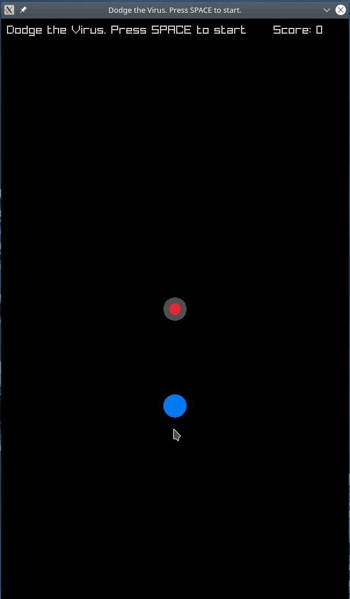

# Dodge

Google has recently announced using Swift (a language developed by Apple (!)) as their next-generation platform for machine learning ([Swift for Tensorflow S4TF](https://github.com/tensorflow/swift)).
See this [blog post](https://tryolabs.com/blog/2020/04/02/swift-googles-bet-on-differentiable-programming/) and this [video](https://www.youtube.com/watch?v=s65BigoMV_I) for details.

This has sparked my interest in the [Swift](https://swift.org/) language again.
The syntax is really nice including optional types and type extensions. Also, it is Open-Source, runs on Linux and has good tooling support for VS Code (SDE and swiftformat by @vknabel).
To check out the C-wrapping capabilities, I wrote a small game in Swift using the [Raylib](https://github.com/raysan5/raylib) C library.

The library can be used without writing any wrapper code, the required bindings are completely autogenerated on-the-fly from the header file without additional manual editing, which is very impressive.

Build and run with `swift run` .

**Since this is my first Swift project it is not optimized for cross-platform compatibility. Currently it only runs on Linux.**

